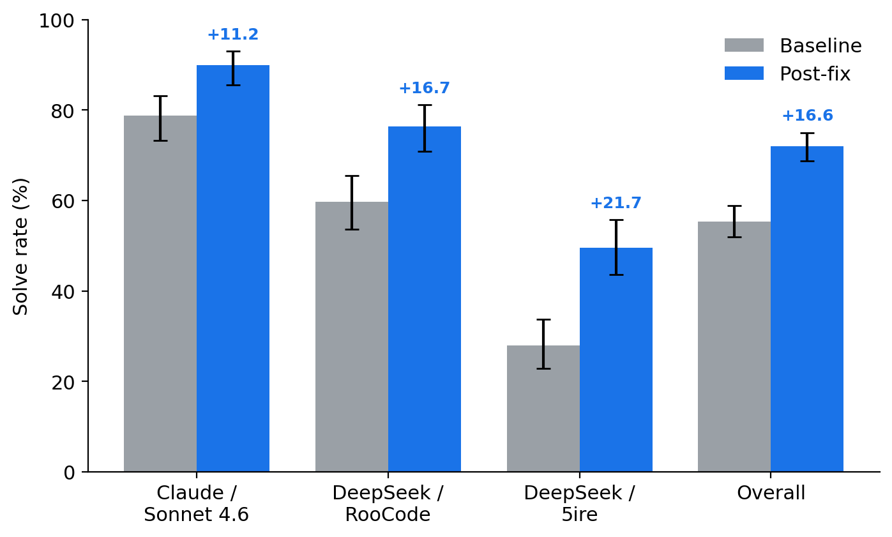
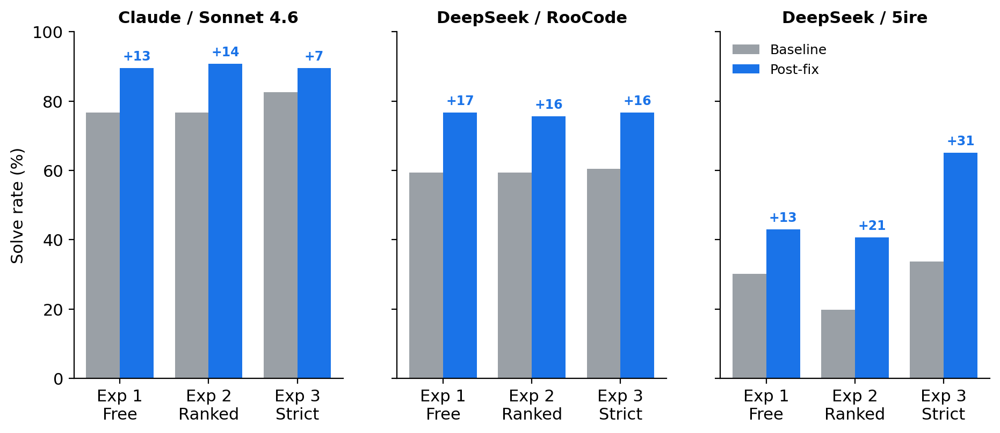
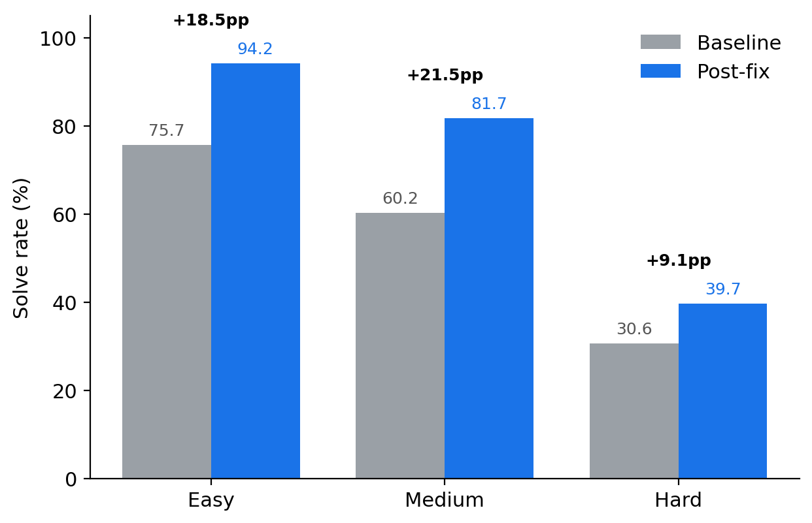
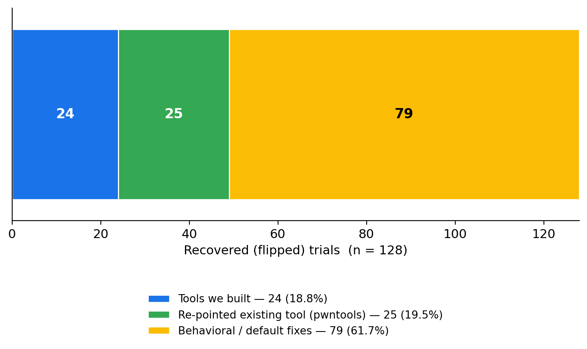
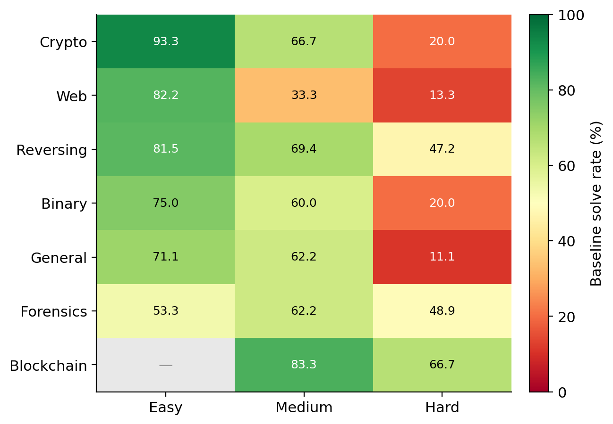

# HexStrike-AI: Evaluation and Targeted Improvements

This repository is a fork of [HexStrike-AI](https://github.com/0x4m4/hexstrike-ai). We used it as the subject of a research project: we measured how well the orchestrator carries an LLM through security challenges, fixed the weak points the measurement exposed, and measured the effect of those fixes. This README covers what the original system is, who we are, what the baseline evaluation showed, what we changed, and what changed as a result.

## The Original System

HexStrike-AI is an open-source orchestrator that exposes a large set of security tools to an LLM agent over the Model Context Protocol (MCP). A Flask server wraps each tool as an HTTP route, and a FastMCP layer presents those routes to the model as callable tools. The agent plans, calls a tool, reads its output, and chains tools toward a goal such as solving a CTF challenge or assessing a target. The version we forked exposes 169 MCP tools backed by 176 server routes over 150+ external Kali utilities.

This fork keeps the upstream architecture and tool set. Installation steps and the full tool catalog are documented in the [upstream repository](https://github.com/0x4m4/hexstrike-ai), and this fork runs the same way. Everything described below is our addition.

## The Team and Why We Did This

We are master's students at the Suzhou Institute for Advanced Research, University of Science and Technology of China. This work is a research project on LLM-driven security tooling, carried out by Romain Gerard and Assmaa Zeghaider under the supervision of Yan Guo. We treated HexStrike-AI as something to study and improve rather than a product to ship. The question was practical: how far does a tool catalog carry an LLM agent, where does that capability stop, and can targeted engineering move the line.

## What the Baseline Showed

We ran 86 picoCTF challenges (27 Easy, 31 Medium, 28 Hard) across seven categories, under three tool-access regimes and three model/client setups, for 774 trials in total. The regimes were free solve (any tool, native or HexStrike), HexStrike-ranked (HexStrike tools with a preference ordering), and HexStrike-strict (HexStrike tools only). The setups were Claude (Sonnet 4.6) through Claude Code, and DeepSeek (deepseek-chat) through two clients, RooCode and 5ire. Holding the model fixed across the two DeepSeek clients let us separate the client's effect from the model's.

The baseline run surfaced the following:

- Capability dropped steeply with difficulty, from 75.7% on Easy to 30.6% on Hard, and the drop held inside almost every category. The hardest cells were General/Hard and Web/Hard.
- The client driving the model mattered as much as the difficulty did. On the same DeepSeek model, RooCode solved 59.7% and 5ire solved 27.9%, a 2.1x gap with nothing changed but the client.
- The two regimes that forbid native tools were not honored. Across them the agents still made 2,908 native `execute_command` calls and 717 `Bash` calls, heaviest on the two weaker clients. A "HexStrike-only" number was therefore a soft constraint, not a clean partition.
- Nine challenges failed in every configuration and every regime. These marked capabilities the baseline tooling did not cover: multi-step web chains, disk forensics, and harder cryptography.
- Two tools the server advertised, `web_request` and `source_code_read`, did not exist, so every call to them failed. One other tool was dead because a second registration shadowed it, and the server bound every network interface while ignoring its own configured loopback default.
- Success detection was hardcoded to the picoCTF flag format in many places, which limited how much of the behavior would carry to real targets.

## What We Changed

The work had three parts: fixes to existing tools and agent behavior, eleven new capability tools, and a pass that decoupled success detection from CTF conventions.

### Fixes to existing tools and behavior

- Input validation and automatic dependency installation for the Python execution tool.
- Session, redirect, and JSON handling for the HTTP testing tool.
- Defaults for port scanning suited to the challenge setting.
- A description rewrite that points binary work at pwntools. This single change recovered more challenges than any other fix.
- A boolean-blind SQL injection extractor.
- Post-processing for oversized forensics output.
- Removal of the two advertised tools that did not exist.
- A bind fix so the server uses its configured loopback default instead of opening every interface.

On top of these, four modifiers apply to every run: a hypothesis-first strategy preamble, a phased decomposition for Hard challenges, a per-call confidence and next-tool signal, and a HexStrike-only constraint injected through the 5ire proxy.

### Eleven new capability tools

Each tool wraps an external capability aimed at a failure we saw in the baseline.

| Tool | What it does | Target challenge(s) |
|------|--------------|---------------------|
| `rsa_factor` | Recovers keys from weak or smooth RSA moduli | Crypto: Very Smooth |
| `compression_oracle` | Builds a CRIME/BREACH byte-by-byte recovery harness | Crypto: Compress and Attack |
| `timing_oracle` | Recovers a secret character by character from response-time or instruction-count differences | Forensics: SideChannel |
| `sqli_order_oracle` | Extracts data via ORDER BY / CASE WHEN boolean-blind injection | Web: ORDER ORDER |
| `evtx_parser` | Parses Windows .evtx logs and surfaces notable entries | Forensics: Event-Viewing |
| `smb_ipp_exploit` | Enumerates SMB shares and IPP/CUPS printers and reads files for secrets | General: Printer Shares 2 and 3 |
| `blockchain_exploit` | Drives the Foundry `cast` CLI (call/send/storage) for access-control, overflow, and reentrancy challenges | Blockchain: Access Control, Smart Overflow, Reentrance |
| ROP-chain builder | Generates a ROP chain (ROPgadget) and a pwntools exploit template | Binary / Hard |
| Disk-image mount | Parses a disk image with The Sleuth Kit, listing allocated and deleted files | Forensics: DISKO 3, UnforgottenBits |
| Encrypted-PCAP decryptor | Decrypts a captured session with tshark using a supplied key (TLS/RSA/WPA) | Forensics: WebNet0, WebNet1 |
| Headless XSS/CSRF chainer | Injects an XSS/CSRF payload and drives a headless browser, capturing DOM, cookies, and alerts | Web: noted, secure-email-service |

### Generalized secret detection

We replaced the hardcoded picoCTF flag format with one configurable detection layer. It keeps the picoCTF prefix by default, so the running evaluation was not affected, and it also recognizes real-world indicators: cloud and API keys, GitHub and Slack tokens, JSON Web Tokens, private-key headers, and credential assignments. The new tools and the fixes were checked against real, non-CTF targets to confirm they run there, though we did not measure solve rate outside picoCTF.

## Results

After applying the changes we re-ran the trials that had not succeeded at baseline, 289 of them, and set aside 56 as out of reach (challenges that would need a substantial new tool, external infrastructure, or infeasible effort to move). Re-runs used the same models, clients, and prompts as the baseline. Overall solve rate rose from 55.4% to 72.0%. Every configuration improved, with baseline and post-fix 95% Wilson confidence intervals that do not overlap and a paired McNemar test at p < 0.001.

Baseline outcomes by configuration:

| Configuration | Solved | Failed | Partial | Rate |
|---------------|:------:|:------:|:-------:|:----:|
| Claude / Sonnet 4.6 | 203 | 39 | 16 | 78.7% |
| DeepSeek / RooCode | 154 | 95 | 9 | 59.7% |
| DeepSeek / 5ire | 72 | 172 | 14 | 27.9% |
| Overall | 429 | 306 | 39 | 55.4% |

### Before and after by configuration

| Configuration | Baseline | Post-fix | Change |
|---------------|:--------:|:--------:|:------:|
| Claude / Sonnet 4.6 | 78.7% | 89.9% | +11.2 pp |
| DeepSeek / RooCode | 59.7% | 76.4% | +16.7 pp |
| DeepSeek / 5ire | 27.9% | 49.6% | +21.7 pp |
| Overall | 55.4% | 72.0% | +16.6 pp |

The regime breakdown shows the client effect from another angle. Claude sits near its ceiling under all three regimes and RooCode lifts roughly evenly, while 5ire shows a strong regime effect, weakest when tool preference is only ranked and strongest when native tools are removed entirely.

### By difficulty

The gradient stayed monotonic after the fixes, with the largest lift in the middle tier and the smallest at Hard.

| Difficulty | Before | After | Change |
|------------|:------:|:-----:|:------:|
| Easy | 75.7% | 94.2% | +18.5 pp |
| Medium | 60.2% | 81.7% | +21.5 pp |
| Hard | 30.6% | 39.7% | +9.1 pp |

### Where the recoveries came from

128 previously-failed trials now pass. Of these, 79 came from the general behavioral and default fixes, 25 from re-pointing the existing pwntools tool, and 24 from the tools we built (22 from the eleven new tools, 2 from the added SQL injection extractor). The one description-level pwntools change accounts for more recoveries than all the tools we built combined.

For seven of the eleven new tools, recorded calls and recoveries break down as below; the other four supplied the remaining two recoveries. The zero for `timing_oracle` is a signal-bound challenge, not a tool that failed to run.

| Tool | Calls | Recoveries |
|------|:-----:|:----------:|
| `rsa_factor` | 2 | 2 |
| `compression_oracle` | 10 | 4 |
| `timing_oracle` | 14 | 0 |
| `smb_ipp_exploit` | 30 | 7 |
| `sqli_order_oracle` | 10 | 2 |
| `evtx_parser` | 17 | 3 |
| `blockchain_exploit` | 10 | 2 |
| Total | 93 | 20 |

### Baseline difficulty and category map

### Run-to-run reliability

To check that single-run verdicts are stable, we re-ran ten challenges three times on each DeepSeek client under the free-solve regime, 60 runs in total. RooCode agreed with itself on all ten. 5ire agreed on seven of ten, with the three that varied sitting on borderline Medium challenges and splitting two-to-one with a clear majority. Across both clients, 17 of 20 were unanimous.

| Configuration | Unanimous (of 10) | Agreement |
|---------------|:-----------------:|:---------:|
| DeepSeek / RooCode | 10 | 100% |
| DeepSeek / 5ire | 7 | 70% |
| Overall | 17/20 | 85% |

### Recorded data

The full per-trial logs are in this repository: baseline runs under `results/`, the post-fix re-runs under `results_with_fixes/`, and the reliability sub-study under `variance_results/`. The analysis and write-up are under `docs/`.

## License

This fork inherits the upstream MIT license. Upstream HexStrike-AI is by Muhammad Osama (0x4m4); the base orchestration, the wrapped tools, and the MCP architecture are theirs. The evaluation design, the fixes and capability tools, and the logging and measurement layer are ours.
